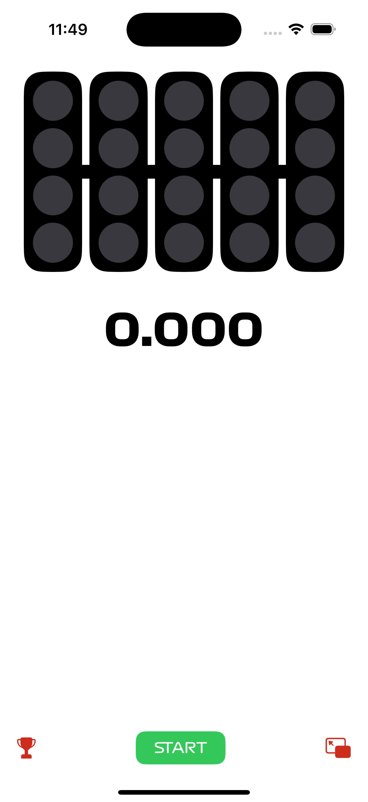

# Simulator-iOS
iOS version of "F1 Race Start Simulator" app
<div style="display: flex; width: 100%; justify-content: center">
    
</div>

## 🛠️ Requirements
<ul style="display: flex; flex-direction: column; gap: 5px;">
    <li>
        
        <strong>Xcode 14.0</strong> or above (project is created using <strong>Xcode 16.0</strong>)
    </li>
    <li>
        
        <strong>Swift 6.0</strong>
    </li>
    <li>
        
        <strong>SwiftUI</strong> usage
    </li>
</ul>

##  Compatibility
This project is compatible with <strong>iOS 16.0</strong> or above.

## 🛠️ Build
### 1. Clone the repository
```bash
git clone https://github.com/F1-Race-Start-Simulator/Simulator-iOS
```

### 2. Open the project in Xcode
```bash
cd Simulator-iOS
open Simulator-iOS.xcodeproj
```

### 3. Build the project
```Cmd (⌘) + B``` on Xcode (or select ```Product > Build``` from the menu)
<p style="color: mediumpurple">Generally, Xcode will build the project automatically when you open it.</p>

### 4. Run the project
```Cmd (⌘) + R``` on Xcode after selecting a simulator or your connected device.